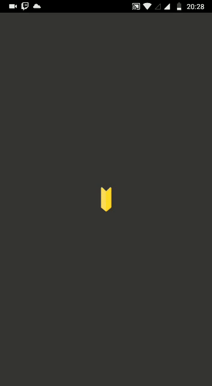

<h1>🧱Scale App🧱<h1>
<h2>Aplicativo Ionic para a conversão de escalas.<h2>

Uma aplicação que envolve lógica básica como forma de testar o framework ionic, nele foi interessante usar o conhecimento que eu adquiri no ensino médio técnico em edificações. Ao fazer esse app pude juntar uma coisa da qual eu gosto (programação) com disciplinas do colégio. 

